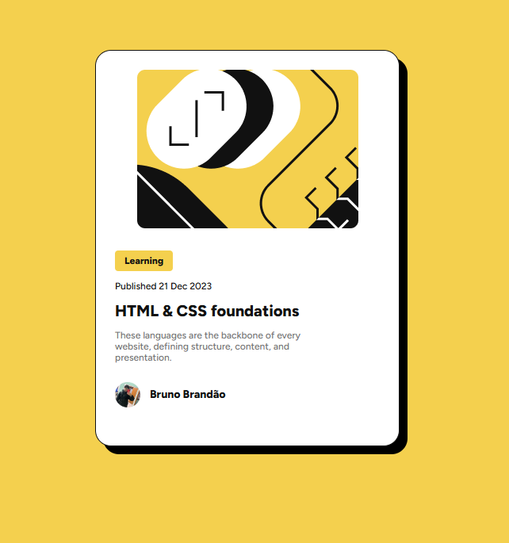

<h1 align="center"> Blog Preview Card </h1>

<p align="center">
Solução para o desafio Blog Preview Card do Frontend Mentor. <br/>
Um projeto focado em HTML e CSS para praticar layouts responsivos e boas práticas de desenvolvimento frontend.
</p>

<p align="center">
  <a href="#-tecnologias">Tecnologias</a>&nbsp;&nbsp;&nbsp;|&nbsp;&nbsp;&nbsp;
  <a href="#-projeto">Projeto</a>&nbsp;&nbsp;&nbsp;|&nbsp;&nbsp;&nbsp;
  <a href="#-layout">Layout</a>&nbsp;&nbsp;&nbsp;|&nbsp;&nbsp;&nbsp;
  <a href="#-como-executar">Como executar</a>&nbsp;&nbsp;&nbsp;|&nbsp;&nbsp;&nbsp;
  <a href="#memo-licença">Licença</a>
</p>

<p align="center">
  
  
</p>

<br>

<p align="center">
  
</p>

## 🚀 Tecnologias

Esse projeto foi desenvolvido com as seguintes tecnologias:

- HTML5 semântico
- CSS3 (Flexbox, Media Queries)
- Google Fonts (Figtree)
- Design responsivo
- Git e Github

## 💻 Projeto

O **Blog Preview Card** é uma solução para o desafio do Frontend Mentor que consiste em criar um card de preview de blog responsivo e interativo.

### Funcionalidades implementadas:

- ✅ Layout responsivo para mobile e desktop
- ✅ Estados de hover nos elementos interativos
- ✅ Tipografia personalizada com Google Fonts
- ✅ Semântica HTML adequada
- ✅ CSS organizado e reutilizável

### Desafios enfrentados:

- Implementação de media queries para responsividade
- Centralização perfeita do card na tela
- Aplicação correta da fonte Figtree
- Ajustes de espaçamento e proporções

## 🔖 Layout

O design foi baseado no desafio do Frontend Mentor. Você pode visualizar:

- [Desafio original no Frontend Mentor](https://www.frontendmentor.io/challenges/blog-preview-card)
- [Design no Figma](https://www.figma.com) (se disponível)

## 🚀 Como executar

1. Clone este repositório:

```bash
git clone https://github.com/brunofreitas1/frontendmentor-blog-preview-exercise.git
```

2. Acesse a pasta do projeto:

```bash
cd frontendmentor-blog-preview-exercise
```

3. Abra o arquivo `index.html` no seu navegador ou use um servidor local:

```bash
# Com Live Server (VS Code)
# Ou simplesmente abra o index.html no navegador
```

## 📱 Responsividade

O projeto foi desenvolvido seguindo a abordagem **Mobile First**:

- **Mobile**: Layout otimizado para telas pequenas
- **Desktop**: Ajustes para telas maiores (min-width: 700px)

## 🎯 Próximos passos

- [ ] Adicionar animações CSS
- [ ] Implementar modo escuro
- [ ] Melhorar acessibilidade
- [ ] Adicionar mais variações de cards

## :memo: Licença

Esse projeto está sob a licença MIT.

---

Desenvolvido com ♥ por Bruno Freitas 🚀
[Frontend Mentor Profile](https://www.frontendmentor.io/profile/brunofreitas1)
